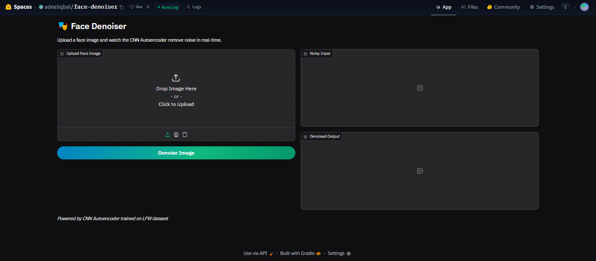
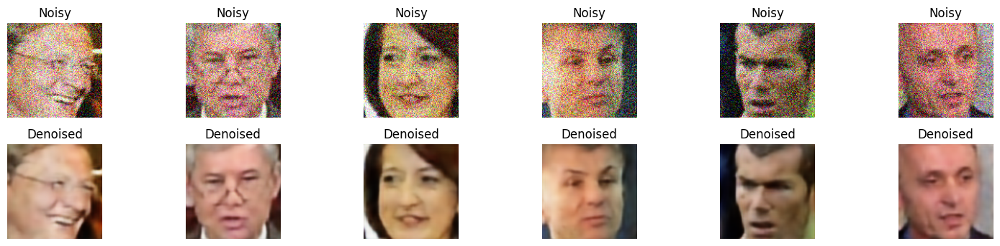
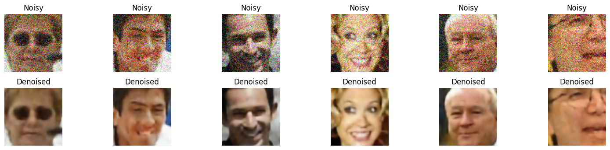

# 🎭 Face Denoiser using Convolutional Autoencoder

A Deep Learning project that removes noise from facial images using a CNN-based Autoencoder architecture. The model is trained on the LFW (Labeled Faces in the Wild) dataset and deployed as an interactive web application.



## 🌟 Features

- **Deep Learning Architecture**: Custom CNN autoencoder with encoder-decoder structure
- **Real-time Denoising**: Instant noise removal from uploaded face images
- **Interactive Web App**: User-friendly Gradio interface deployed on HuggingFace Spaces
- **High Performance**: Trained on 3,589 images with validation loss of 0.0013 MSE

## 🚀 Live Demo

Try the application live on HuggingFace Spaces:

**[🤗 Face Denoiser - Live Demo](https://huggingface.co/spaces/adeeliqbal/face-denoiser)**

## 📊 Results

The model effectively removes Gaussian noise from facial images while preserving facial features and details.

<div align="center">
  
  
</div>

## 🏗️ Model Architecture

```
Encoder:
- Conv2D(32) → MaxPooling
- Conv2D(64) → MaxPooling  
- Conv2D(128) → MaxPooling

Decoder:
- Conv2D(128) → UpSampling
- Conv2D(64) → UpSampling
- Conv2D(32) → UpSampling
- Conv2D(3, activation='sigmoid')

Total Parameters: 333,955
```

## 📁 Project Structure

```
face-denoiser-cnn-autoencoder/
│
├── assets/
│   ├── app_image.png
│   ├── output_imgs2.png
│   └── output_imgs3.png
│
├── app.py                                    # Gradio web application
├── requirements.txt                          # Python dependencies
├── cnn_face_denoiser.keras                  # Trained model (Keras format)
├── cnn_face_denoiser.h5                     # Trained model (H5 format)
├── face_denoiser_cnn_autoencoder.ipynb      # Training notebook
└── README.md                                # Project documentation
```

## 🛠️ Installation & Setup

### Prerequisites
- Python 3.8+
- TensorFlow 2.x
- OpenCV
- Gradio

### Local Installation

1. **Clone the repository**
```bash
git clone https://github.com/adeel-iqbal/face-denoiser-cnn-autoencoder.git
cd face-denoiser-cnn-autoencoder
```

2. **Install dependencies**
```bash
pip install -r requirements.txt
```

3. **Run the application**
```bash
python app.py
```

The app will launch at `http://localhost:7860`

## 📖 Usage

### Web Interface
1. Upload a face image (JPG, PNG, etc.)
2. Click "Denoise Image"
3. View the noisy and denoised outputs side-by-side

### Programmatic Usage
```python
import tensorflow as tf
import numpy as np
import cv2

# Load model
model = tf.keras.models.load_model("cnn_face_denoiser.keras")

# Preprocess image
img = cv2.imread("your_image.jpg")
img = cv2.resize(img, (128, 128))
img = img.astype('float32') / 255.0

# Denoise
denoised = model.predict(np.expand_dims(img, axis=0))[0]
```

## 🎯 Training Details

- **Dataset**: LFW (Labeled Faces in the Wild) - 4,487 detected faces
- **Train/Val Split**: 80/20 (3,589 / 898 images)
- **Input Size**: 128×128×3
- **Noise Type**: Gaussian noise (factor: 0.2)
- **Optimizer**: Adam
- **Loss Function**: Mean Squared Error (MSE)
- **Epochs**: 30
- **Batch Size**: 32
- **Final Training Loss**: 0.0012
- **Final Validation Loss**: 0.0013

### Training Results
The model shows excellent convergence with minimal overfitting:
- Consistent decrease in both training and validation loss
- Final validation MSE: 0.0013

## 🔧 Technologies Used

- **TensorFlow/Keras**: Deep learning framework
- **OpenCV**: Image processing
- **NumPy**: Numerical computations
- **Gradio**: Web interface
- **Scikit-learn**: Data splitting
- **HuggingFace Spaces**: Deployment platform

## 📈 Performance Metrics

| Metric | Value |
|--------|-------|
| Model Parameters | 333,955 |
| Model Size | 1.27 MB |
| Final Val Loss | 0.0013 MSE |
| Training Time | ~2.5 min/epoch |
| Inference Time | <100ms per image |

## 🤝 Contributing

Contributions are welcome! Please feel free to submit a Pull Request.

1. Fork the repository
2. Create your feature branch (`git checkout -b feature/AmazingFeature`)
3. Commit your changes (`git commit -m 'Add some AmazingFeature'`)
4. Push to the branch (`git push origin feature/AmazingFeature`)
5. Open a Pull Request

## 👤 Author

**Adeel Iqbal Memon**

- 📧 Email: adeelmemon096@yahoo.com
- 💼 LinkedIn: [linkedin.com/in/adeeliqbalmemon](https://linkedin.com/in/adeeliqbalmemon)
- 🐙 GitHub: [@adeel-iqbal](https://github.com/adeel-iqbal)
- 🤗 HuggingFace: [Face Denoiser Space](https://huggingface.co/spaces/adeeliqbal/face-denoiser)

## 🙏 Acknowledgments

- LFW dataset creators and Kaggle community
- TensorFlow and Keras teams
- Gradio and HuggingFace for deployment infrastructure
- Open-source computer vision community

---

⭐ **If you found this project helpful, please consider giving it a star!**

**Live Demo**: https://huggingface.co/spaces/adeeliqbal/face-denoiser
